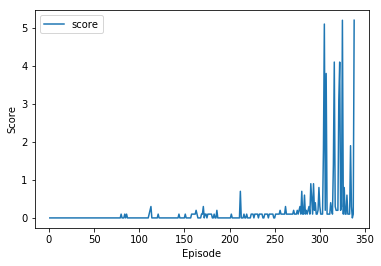

# Tennis

## Solution

To solve this problem, I re-used the solution from the continuous-control project ([github](https://github.com/YoucefZemmouri/Continuous-Control)) where I used a multi-DDPG approach.
I used a Multi-DDPG agent where we have two actors (one Actor per player) and a common Critic. Additionally, I used two
separate replay buffer for simpler implementation: each replay buffer has all records (state, action, reward, next_state, done) 
and at the update step, we update the two actors (using each replay buffer: ```replay_buffer_1``` for actor 1 and ```replay_buffer_2``` for actor 2)
and the critic using the two buffers.

At each step, we train the actors and the critics (with norm clipping as for the continuous-control project) twice. 

For the actor and the critic: 2 fully connected layers with Batch normalization (BatchNorm1d). For the actor, the sizes were 33 -> 256 -> 128 -> 4.
For the critic, the sizes were: 33 -> 256 -> 128 -> 1

I used the following parameters:

replay buffer size = int(1e6)  
minibatch size = 256        
discount factor = 0.99            
for soft update of target parameters = 1e-3              
learning rate of the actor  = 1e-4      
learning rate of the critic = 1e-4
weight decay = 0
Ornstein-Uhlenbeck mu = 0  
Ornstein-Uhlenbeck theta = 0.15       
Ornstein-Uhlenbeck sigma = 0.2  

Additionally, I used a decay by 1e-8 starting from 1.00.


In the jupyter notebook, you can see the training meeting the succes criteria at the end.

## Results and next steps

The following plot shows the average reward per episode during training. As the reward per episode reaches 5.200 
on episode 338, the problem is solved at episode 338 where we exceed 0.5 over the last 100 episodes (displayed in the ```Tennis.ipynb``` notebook):
```angular2html
Problem solved at episode 338 with average score on the last 100 episodes 0.5270000078529119
```



For the future, I can optimize the parameters with extensive hyper-tuning:  different actor and critic structures, other noises strategy and different learning rates.
Additionally,  I can improve the overall architecture by having one replay buffer (instead of two) by maybe doubling the input sizes of the input and output for the critic.
Finally, I can explore other algorithms as Minmax-Q, JAL or FMQ.
